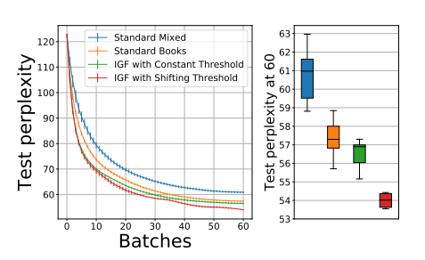

# Information Gain Filtration(IGF)

Authors @Tuko @mraunak

This folder contains the code how to implement IGF for finetuning on GPT-2.

## What is IGF?

Here we present a general fine-tuning method that we call information gain filtration for improving the overall training efficiency and final
performance of language model fine-tuning(see paper below). The method is an alternative fine-tuning method that trains
a secondary model (e.g., a simple convolutional network) to predict the amount of information
gained over a given pre-trained model. The secondary model is lightweight and trained to
predict the Information Gain measure. Information Gain is defined as the change in a loss
function for a model before and after an SGD update with a sample (Equation X in the paper).
A small subset of the training set named the “objective” set, is used to measure information
gain on the pre-trained model, and consequently to train the secondary model. After 
training, the model is used for filtering samples for the fine-tuning process. Therefore, 
a high information gain value would suggest a sample is informative, whereas a low value
would suggest a non-informative sample that should be filtered out. Thus, a thresholding
strategy is defined to select informative samples. With such a strategy, samples are filtered
and once enough samples are selected to form a mini-batch and a usual fine-tuning/optimization
step is applied. The filtration process is repeated until the fine-tuning process is over. 

Paper [Selecting Informative Contexts Improves Language Model Finetuning](https://arxiv.org/abs/2005.00175)

# Results

Several experiments were conducted to show the robustness of the IGF method versus the
standard fine-tuning process. For example, we achieve a median perplexity of 54.0 on the 
Books dataset compared to 57.3 for standard fine-tuning on GPT-2 Small. The code was
implemented using the Transformers library and Pytorch. While the method may seem more
expensive, we saw enough evidence that it may lead to a performance benefit in the final models.   



Figure 1: Comparing IGF to Standard Fine-tuning:
IGF with constant (p < 10−3 , t-test) and shifting(p < 10−6 , t-test) thresholding significantly outperform standard fine-tuning. The left-hand figure shows
test-set perplexity after each fine-tuning batch, averaged over 50 runs (error bars denote ± one standard error). The right-hand figure shows the perplexity of each
method after 60 batches. IGF with shifting thresholding (red) clearly improves over standard batched fine-tuning with Adam

## How to use this project?

To do
describe command line parameters
```python
python run_clm_igf.py --data data/
```

## Citation

If you find the resource useful, please cite the following paper

```
@inproceedings{antonello-etal-2021-selecting,
    title = "Selecting Informative Contexts Improves Language Model Fine-tuning",
    author = "Antonello, Richard and Beckage, Nicole and Turek, Javier and Huth, Alexander",
    booktitle = "Proceedings of the 59th Annual Meeting of the Association for Computational Linguistics and the 11th International Joint Conference on Natural Language Processing (Volume 1: Long Papers)",
    month = aug,
    year = "2021",
    address = "Online",
    publisher = "Association for Computational Linguistics",
    url = "https://aclanthology.org/2021.acl-long.87",
    doi = "10.18653/v1/2021.acl-long.87",
    pages = "1072--1085",
}
```